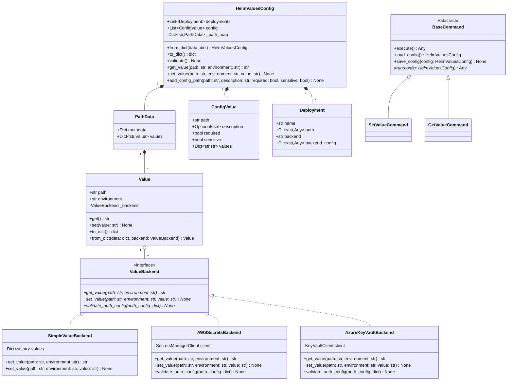

# Low Level Design - Helm Values Manager

## Core Components

### 1. Domain Model

The core domain model consists of several key classes that manage configuration values and their storage:



### 2. Value Management

The system uses a unified approach to value storage and resolution through the `Value` class:

```python
class Value:
    def __init__(self, path: str, environment: str,
                 backend: ValueBackend):
        self.path = path
        self.environment = environment
        self._backend = backend

    def get(self) -> str:
        """Get the resolved value"""
        return self._backend.get_value(self.path, self.environment)

    def set(self, value: str) -> None:
        """Set the value"""
        if not isinstance(value, str):
            raise ValueError("Value must be a string")
        self._backend.set_value(self.path, self.environment, value)
```

Key features:
- Encapsulated value resolution logic
- Unified interface for all storage backends
- Clear separation of concerns
- Type-safe value handling

### 3. Command Pattern

All CLI commands inherit from `BaseCommand` to ensure consistent behavior:

```python
class BaseCommand:
    def execute(self) -> Any:
        try:
            config = self.load_config()
            result = self.run(config)
            self.save_config(config)
            return result
        except Exception as e:
            # Handle errors, cleanup if needed
            raise

    def load_config(self) -> HelmValuesConfig:
        # Implement file loading with locking
        pass

    def save_config(self, config: HelmValuesConfig) -> None:
        # Implement file saving with backup
        pass

    @abstractmethod
    def run(self, config: HelmValuesConfig) -> Any:
        # Subclasses implement command-specific logic
        pass
```

Benefits:
- Consistent file operations
- Built-in error handling
- Automatic file locking
- Configuration backup support

### 4. Storage Backends

The `ValueBackend` interface defines the contract for value storage:

```python
class ValueBackend(ABC):
    @abstractmethod
    def get_value(self, path: str, environment: str) -> str:
        """Get a value from storage."""
        pass

    @abstractmethod
    def set_value(self, path: str, environment: str, value: str) -> None:
        """Store a value."""
        pass

    @abstractmethod
    def validate_auth_config(self, auth_config: dict) -> None:
        """Validate backend-specific authentication configuration."""
        pass
```

Implementations:
- SimpleValueBackend (for non-sensitive values)
- AWS Secrets Manager Backend
- Azure Key Vault Backend
- Additional backends can be easily added

## Implementation Details

### 1. Configuration Structure

The configuration follows the v1 schema:
```json
{
    "version": "1.0",
    "release": "my-app",
    "deployments": {
        "prod": {
            "backend": "aws",
            "auth": {
                "type": "managed_identity"
            },
            "backend_config": {
                "region": "us-west-2"
            }
        }
    },
    "config": [
        {
            "path": "app.replicas",
            "description": "Number of application replicas",
            "required": true,
            "sensitive": false,
            "values": {
                "dev": "3",
                "prod": "5"
            }
        }
    ]
}
```

### 2. Value Resolution Process

1. Path Lookup:
   - O(1) lookup in `_path_map`
   - Validates path existence
   - Retrieves value metadata

2. Value Resolution:
   - Uses `Value` class to handle resolution
   - Automatically selects storage backend
   - Handles errors and validation

### 3. Security Features

1. Value Protection:
   - Sensitive value marking
   - Secure storage in remote backends
   - Authentication validation

2. File Safety:
   - Automatic file locking
   - Backup before writes
   - Atomic updates

## Benefits of This Design

1. **Separation of Concerns**
   - Domain logic in `HelmValuesConfig`
   - Storage logic in backends
   - Clean interface boundaries

2. **Extensibility**
   - Easy to add new backends
   - Auth handling per backend
   - Consistent validation

3. **Maintainability**
   - Central configuration management
   - Clear data flow
   - Type safety through domain model

4. **Testing**
   - Easy to mock backends
   - Clear component boundaries
   - Isolated validation testing

## Next Steps

1. Implement the Value class
2. Add comprehensive validation
3. Implement caching strategy
4. Add value encryption support
5. Enhance error handling
