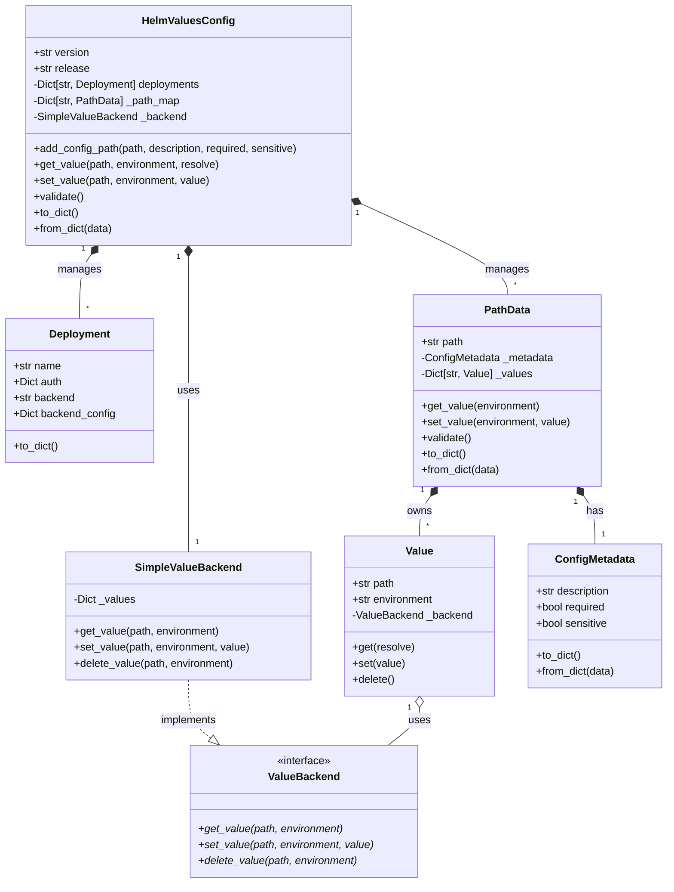
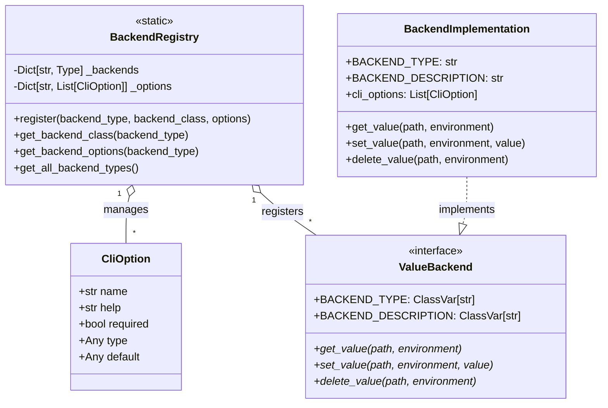
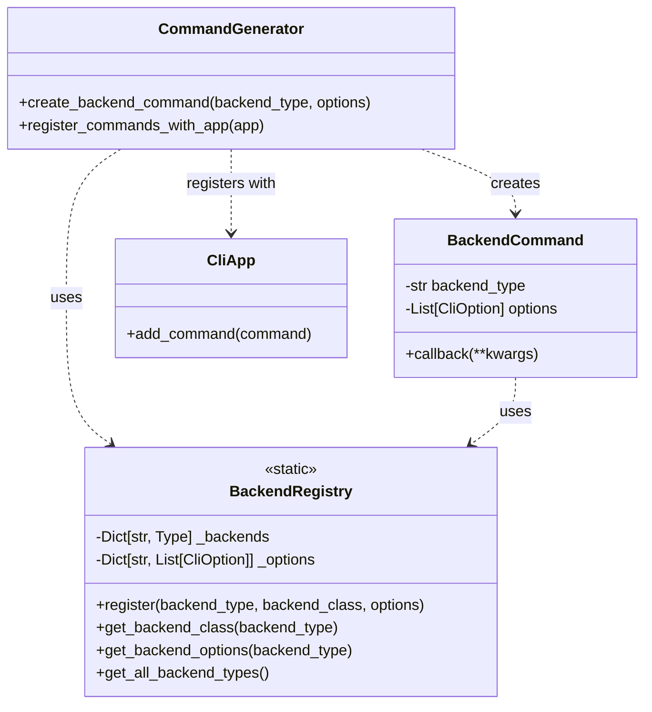

# Low Level Design - Helm Values Manager

## Revision History

| Date | Description | ADR Reference |
|------|-------------|--------------|
| 2025-02-15 | Initial design | - |
| 2025-03-07 | Added Backend Registry System | [ADR-012](../ADRs/012-backend-specific-command-registration.md) |


## Core Components

### 1. Domain Model

The core domain model consists of several key classes that manage configuration values and their storage:



### 2. Component Organization

1. **Core Configuration Manager**

   - `HelmValuesConfig`: Central manager that coordinates between deployment configurations and value management. It maintains separate collections for deployments and path data, ensuring they remain decoupled while working together at runtime.

2. **Deployment Management Subsystem**

   - `Deployment`: Represents a deployment environment (e.g., dev, prod) and its associated backend configuration. Defines HOW values are stored.
   - `ValueBackend`: Interface defining the contract for value storage backends.
   - `SimpleValueBackend`: Default implementation for storing non-sensitive values in memory.

3. **Value Management Subsystem**
   - `PathData`: Manages a configuration path's metadata and values. Contains WHAT is stored.
   - `Value`: Represents a specific value for a path in an environment.
   - `ConfigMetadata`: Stores metadata about a configuration path (description, required, sensitive).

### 3. Key Design Points

1. **Separation of Concerns**

   - Deployment configurations (HOW) and value management (WHAT) are separate subsystems
   - `HelmValuesConfig` coordinates between them but they don't directly interact
   - This allows independent evolution of storage backends and value management

2. **Value Storage**

   - Values are stored in a flat structure using paths
   - Each value knows its environment but isn't directly tied to a deployment
   - The backend used for storage is determined at runtime based on deployment configuration

3. **Metadata Management**
   - Each path has associated metadata managed by `PathData`
   - Metadata influences validation and storage behavior but doesn't affect the deployment configuration

### 4. Value Management

The value management system is designed to be flexible and extensible, supporting different types of values and storage backends:

1. **Path-Based Value Organization**

   - Values are organized by paths (e.g., "app.replicas", "db.password")
   - Each path has associated metadata (description, required, sensitive)
   - Values for each path can be set per environment

2. **Value Storage and Retrieval**

   - Values are stored using backends defined by deployments
   - Non-sensitive values use the SimpleValueBackend
   - Sensitive values can use specialized backends (e.g., AWS Secrets Manager)
   - Values can be retrieved in raw form or with secret references resolved

3. **Validation Rules**

   - Paths must be unique across the configuration
   - Required paths must have values in all environments
   - Values must match their expected type (string, number, boolean)
   - Secret references must be valid and resolvable

4. **Security Considerations**
   - Sensitive values are marked in metadata
   - Different storage backends for sensitive vs non-sensitive data
   - Secret references allow secure value resolution

### 5. Configuration File Format

The configuration file format is defined by a JSON schema that ensures consistency and validation of all configuration data. The schema is available at [`schemas/v1.json`](../helm_values_manager/schemas/v1.json).

Key aspects of the configuration format:

1. **Core Structure**

   - Version information (currently 1.0)
   - Release name (for Helm release identification)
   - Deployment configurations (backend and authentication settings)
   - Value configurations (paths, metadata, and environment-specific values)

2. **Validation Rules**
   - Required fields (version, release, deployments, config)
   - Value type constraints (string, number, boolean, null)
   - Name format restrictions (lowercase alphanumeric with hyphens)
   - Backend configuration requirements (backend type, auth method)

### 6. Error Handling

The system implements comprehensive error handling at multiple levels:

1. **Validation Errors**

   - Schema validation using JSON Schema
   - Path uniqueness checks
   - Required value validation
   - Type validation for values
   - Deployment configuration validation

2. **Runtime Errors**

   - Backend connection failures
   - Authentication errors
   - File access errors
   - Concurrent access conflicts

3. **Error Propagation**
   - Low-level components raise specific exceptions
   - Higher-level components catch and wrap errors with context
   - Command layer translates errors to user-friendly messages
   - All errors are logged with appropriate detail level

### 7. Secret Reference Resolution

The system supports resolving secret references to their actual values:

1. **Reference Format**

   - Secret references use the format: `secret://<backend>/<path>`
   - Example: `secret://aws/prod/db/password`
   - References can be nested in string values

2. **Resolution Process**

   - When `resolve=True` in get_value:
     1. Parse the value for secret references
     2. For each reference:
        - Validate reference format
        - Check backend availability
        - Fetch actual value from backend
     3. Replace references with actual values
     4. Return resolved string

3. **Security**
   - References are stored instead of actual secrets
   - Resolution happens only when explicitly requested
   - Backend permissions control access to actual secrets
   - Failed resolutions return None or raise error based on context

## Backend Registry System

The Backend Registry System enables dynamic registration and discovery of backend types and their CLI options. This system was added as part of [ADR-012](../ADRs/012-backend-specific-command-registration.md) to improve the user experience by providing backend-specific commands.

### 1. Component Organization



### 2. Command Generation System

The Command Generation System dynamically creates backend-specific commands based on the registered backends:



### 3. Backend Registration Process

1. Backend classes use the `@register_backend` decorator to register themselves with the `BackendRegistry`
2. The decorator adds class variables and registers CLI options specific to the backend
3. At application startup, all backend modules are imported, triggering registration
4. The `CommandGenerator` queries the registry for all registered backends
5. For each backend, a specific command is created with typed options
6. Commands are registered with the main CLI application

### 4. Integration with Existing Components

The `ValueBackend` interface is extended with class variables for type and description:

```python
class ValueBackend:
    """Base class for all value backends."""
    BACKEND_TYPE: ClassVar[str] = ""
    BACKEND_DESCRIPTION: ClassVar[str] = ""

    def __init__(self, auth_config: Dict[str, Any]) -> None:
        """Initialize the backend with authentication configuration."""
        self._auth_config = auth_config
        self._backend_config = {}
        self._validate_auth_config(auth_config)
```

Backend implementations use the registration decorator and define CLI options:

```python
@register_backend(
    backend_type="gcp",
    description="Google Cloud Secret Manager backend",
    options=[
        CliOption("--service-account", help="Service account JSON credentials", required=True),
        CliOption("--prefix", help="Prefix for secret names", required=False)
    ]
)
class GCPSecretManagerBackend(ValueBackend):
    """Backend for storing sensitive values in Google Cloud Secret Manager."""

    def __init__(self, auth_config: Dict[str, str]) -> None:
        """Initialize the GCP Secret Manager backend."""
        super().__init__(auth_config)
        # Implementation details...
```

## Implementation Details

### 1. Configuration Structure

Below is an early example of the configuration structure. Note that the schema has evolved since then - for the latest schema definition, refer to [`schemas/v1.json`](../helm_values_manager/schemas/v1.json). This example is kept for historical context and to demonstrate the basic concepts:

```json
{
  "version": "1.0",
  "release": "my-app",
  "deployments": {
    "prod": {
      "backend": "gcp",
      "auth": {
        "type": "managed_identity"
      },
      "backend_config": {
        "region": "us-central1"
      }
    }
  },
  "config": [
    {
      "path": "app.replicas",
      "description": "Number of application replicas",
      "required": true,
      "sensitive": false,
      "values": {
        "dev": "3",
        "prod": "5"
      }
    },
    {
      "path": "app.database.password",
      "description": "Database password",
      "required": true,
      "sensitive": true,
      "values": {
        "dev": "secret://gcp-secrets/my-app/dev/db-password",
        "prod": "secret://gcp-secrets/my-app/prod/db-password"
      }
    }
  ]
}
```

### 2. Value Resolution Process

1. Path Lookup:

   - O(1) lookup in `_path_map`
   - Validates path existence
   - Retrieves value metadata

2. Value Resolution:
   - Uses `Value` class to handle resolution
   - Automatically selects storage backend
   - Handles errors and validation

### 3. Security Features

1. Value Protection:

   - Sensitive value marking
   - Secure storage in remote backends
   - Authentication validation

2. File Safety:
   - Automatic file locking
   - Backup before writes
   - Atomic updates

## Logging System

The logging system follows Helm plugin conventions and provides consistent output formatting:

1. **HelmLogger Class**

   - Provides debug and error logging methods
   - Follows Helm output conventions
   - Uses stderr for all output
   - Controls debug output via HELM_DEBUG environment variable

2. **Global Logger Instance**

   - Available via `from helm_values_manager.utils.logger import logger`
   - Ensures consistent logging across all components
   - Simplifies testing with mock support

3. **Performance Features**

   - Uses string formatting for efficiency
   - Lazy evaluation of debug messages
   - Minimal memory overhead

4. **Testing Support**
   - Mockable stderr output
   - Environment variable control
   - String format verification

## Benefits of This Design

1. **Separation of Concerns**

   - Domain logic in `HelmValuesConfig`
   - Storage logic in backends
   - Clean interface boundaries

2. **Extensibility**

   - Easy to add new backends
   - Auth handling per backend
   - Consistent validation

3. **Maintainability**

   - Central configuration management
   - Clear data flow
   - Type safety through domain model

4. **Testing**
   - Easy to mock backends
   - Clear component boundaries
   - Isolated validation testing

## Next Steps

1. Implement the Value class
2. Add comprehensive validation
3. Implement caching strategy
4. Add value encryption support
5. Enhance error handling
