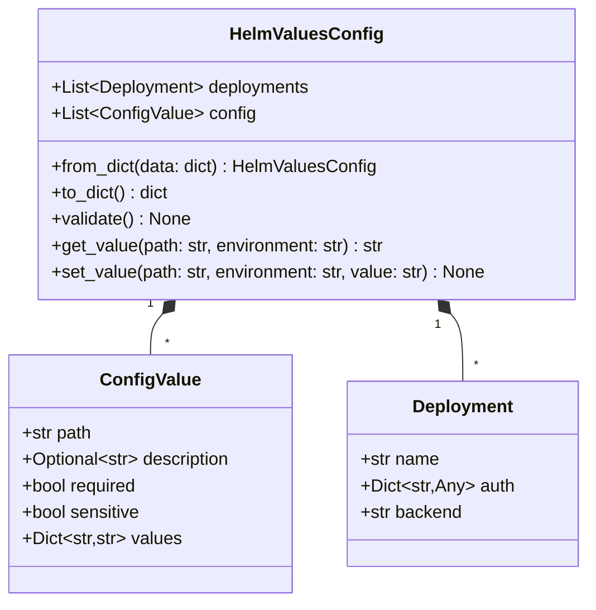
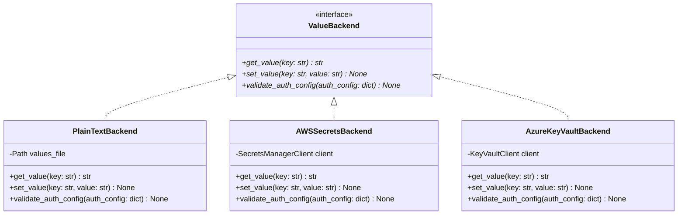
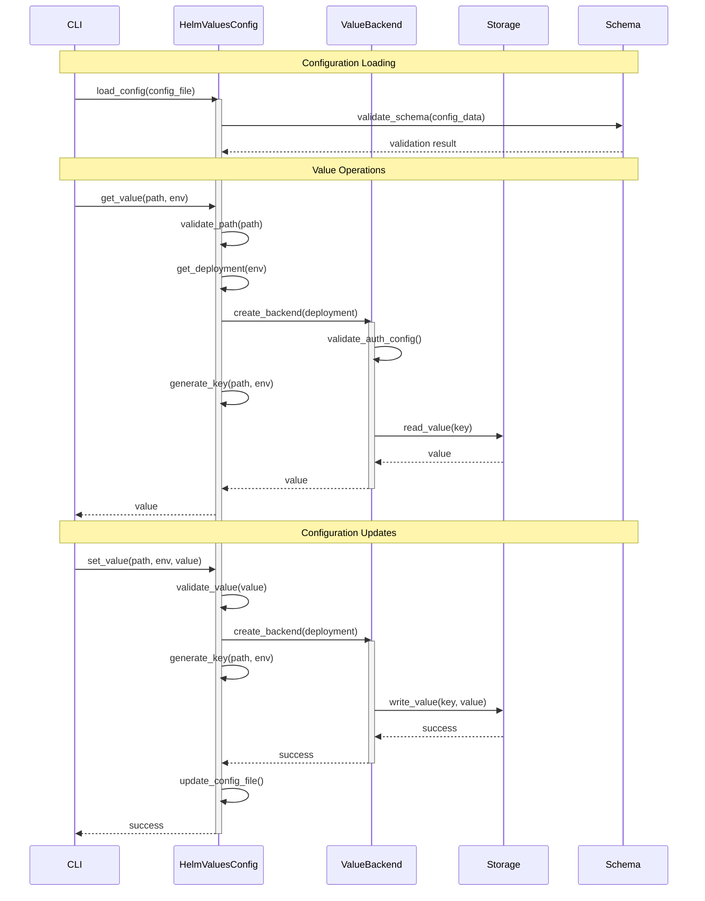

# Low Level Design - Helm Values Manager

## Core Components

### Domain Model

The core domain model is represented by `HelmValuesConfig`, which is the central data structure for managing configuration values.



### Value Storage

The value storage system follows a clean separation between the domain model and storage backends. The key design principle is separation of concerns:
1. `HelmValuesConfig` handles the organization of values (paths and environments)
2. `ValueBackend` focuses purely on key-value storage



Key responsibilities:

1. **HelmValuesConfig**:
   - Maintains the path/environment organization
   - Generates unique keys for the backend
   - Maps keys back to path/environment structure
   ```python
   class HelmValuesConfig:
       def _generate_key(self, path: str, environment: str) -> str:
           # Could use various strategies
           return f"{path}:{environment}"  # Simple concatenation
           # or
           # return hashlib.sha256(f"{path}:{environment}".encode()).hexdigest()

       def get_value(self, path: str, environment: str) -> str:
           deployment = self._get_deployment(environment)
           backend = self._create_backend(deployment)
           key = self._generate_key(path, environment)
           return backend.get_value(key)
   ```

2. **ValueBackend**:
   - Focuses purely on key-value storage
   - Handles storage-specific authentication
   - Manages storage operations and error handling
   ```python
   class ValueBackend(ABC):
       @abstractmethod
       def get_value(self, key: str) -> str:
           """Get a value from storage using a unique key."""
           pass

       @abstractmethod
       def set_value(self, key: str, value: str) -> None:
           """Store a value using a unique key."""
           pass
   ```

This design provides several benefits:
1. **Clean Separation**: Each component has a single responsibility
2. **Cloud Provider Alignment**: Better matches cloud secret manager APIs
3. **Simplified Backend Implementation**: Reduces complexity in backends
4. **Future Extensibility**: Easy to add new organizational schemes

### Configuration Flow

The configuration flow shows how data moves through the system:



This flow diagram shows:
1. **Configuration Loading**
   - Loading from JSON file
   - Schema validation
   - Deployment configuration

2. **Value Operations**
   - Path validation
   - Deployment resolution
   - Backend creation and auth
   - Storage interaction

3. **Configuration Updates**
   - Value validation
   - Storage updates
   - Configuration persistence

## Implementation Details

### HelmValuesConfig as Central Model

1. `HelmValuesConfig` acts as the central model and coordinator:
   - Manages configuration validation
   - Handles backend creation and lifecycle
   - Provides a unified interface for value operations

2. Value operations flow:
   ```python
   class HelmValuesConfig:
       def get_value(self, path: str, environment: str) -> str:
           # Find the deployment for this path/environment
           deployment = self._get_deployment(environment)

           # Create and validate the backend
           backend = self._create_backend(deployment)

           # Get the value through the backend
           return backend.get_value(self._generate_key(path, environment))
   ```

### Backend Implementation

1. Each backend implements the `ValueBackend` interface:
   ```python
   class ValueBackend(ABC):
       @abstractmethod
       def get_value(self, key: str) -> str:
           pass

       @abstractmethod
       def set_value(self, key: str, value: str) -> None:
           pass

       @abstractmethod
       def validate_auth_config(self, auth_config: dict) -> None:
           pass
   ```

2. Backends handle storage-specific operations:
   - Authentication
   - Value serialization/deserialization
   - Storage-specific error handling

### Authentication Flow

1. Authentication is handled per deployment:
   ```python
   class HelmValuesConfig:
       def _create_backend(self, deployment: Deployment) -> ValueBackend:
           # Create the appropriate backend
           backend = self._backend_factory.create(deployment.backend)

           # Validate auth config
           backend.validate_auth_config(deployment.auth)

           return backend
   ```

2. Each backend defines its auth requirements:
   ```python
   class AWSSecretsBackend(ValueBackend):
       def validate_auth_config(self, auth_config: dict) -> None:
           if auth_config["type"] == "direct":
               required = ["access_key_id", "secret_access_key"]
               self._validate_required_fields(auth_config, required)
   ```

## Benefits of This Design

1. **Separation of Concerns**
   - Domain logic in `HelmValuesConfig`
   - Storage logic in backends
   - Clean interface boundaries

2. **Extensibility**
   - Easy to add new backends
   - Auth handling per backend
   - Consistent validation

3. **Maintainability**
   - Central configuration management
   - Clear data flow
   - Type safety through domain model

4. **Testing**
   - Easy to mock backends
   - Clear component boundaries
   - Isolated validation testing

## Next Steps

1. Implement the backend factory pattern
2. Add more comprehensive validation in `HelmValuesConfig`
3. Implement caching strategy for backend instances
4. Add observability (logging, metrics)
5. Implement value encryption for sensitive data
