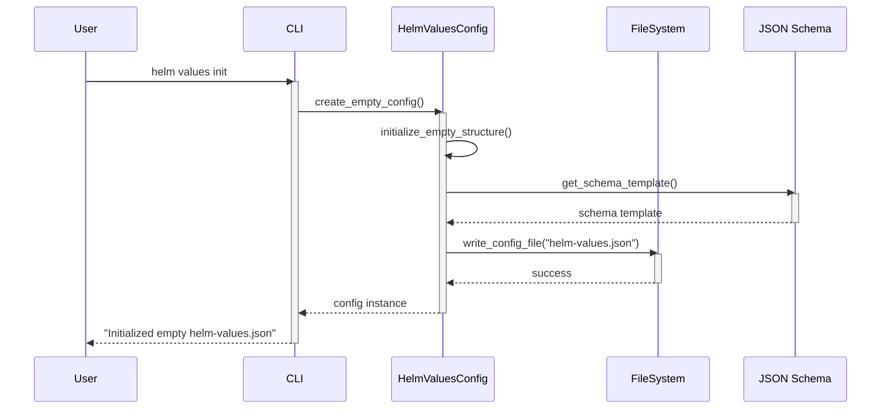
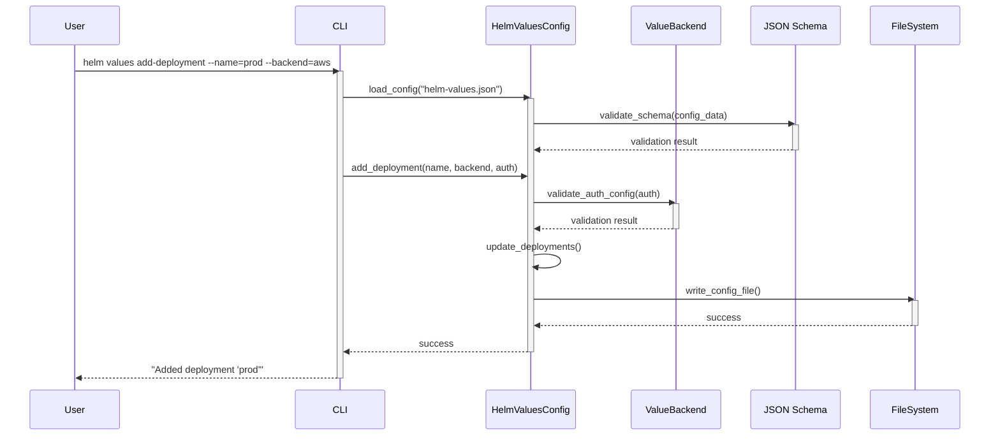
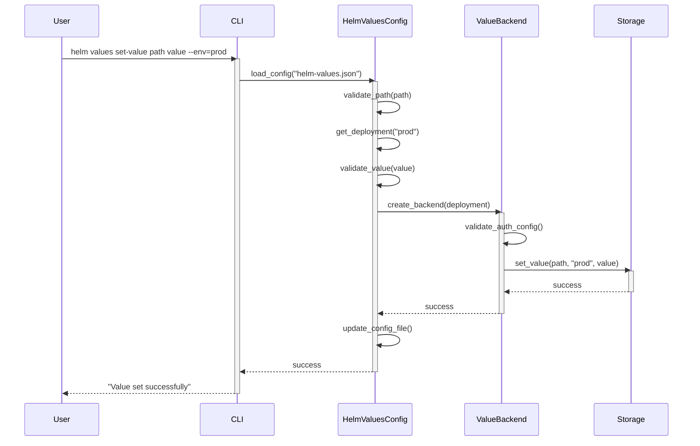
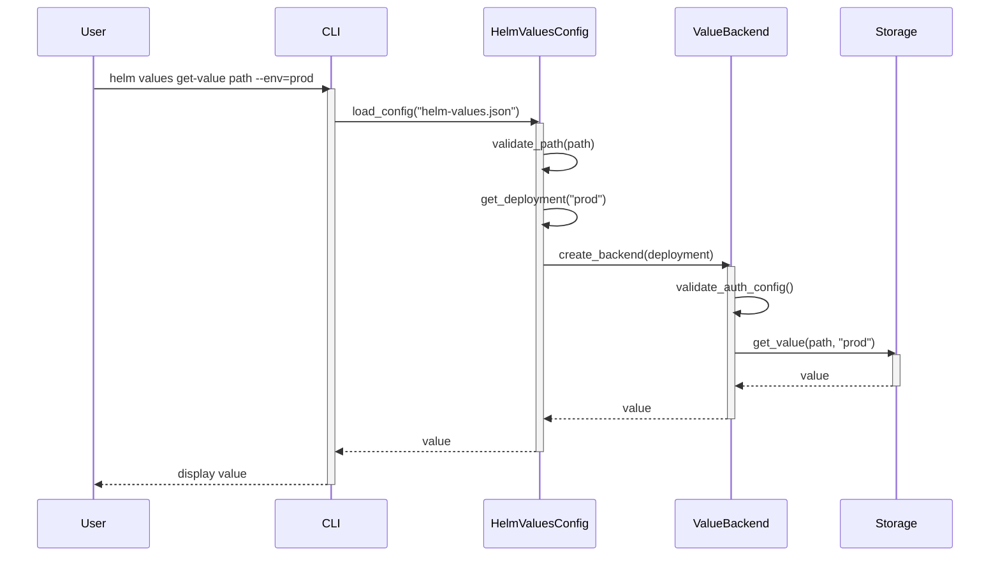
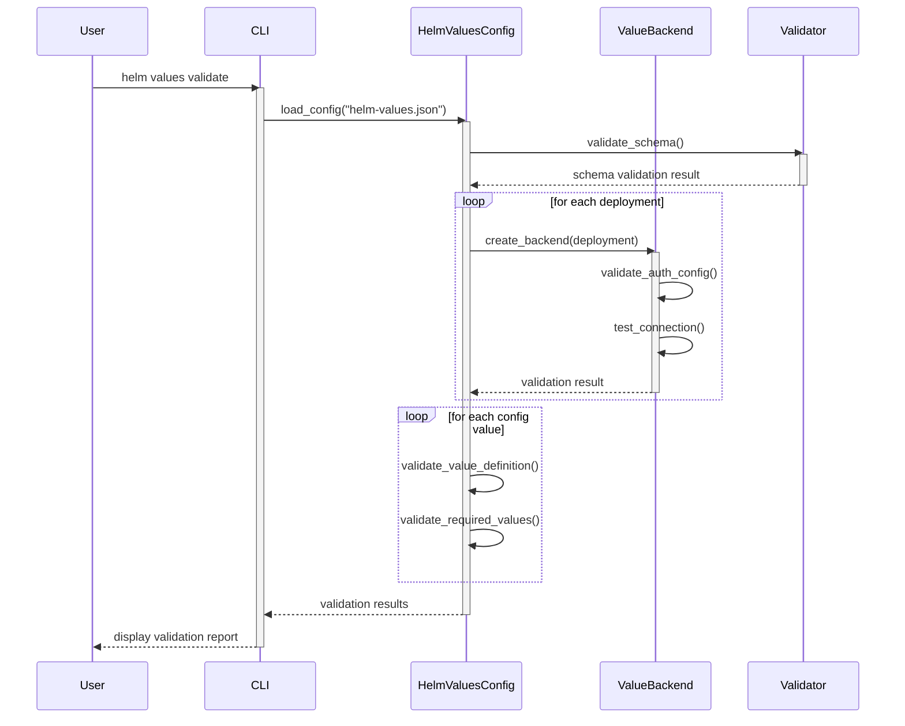
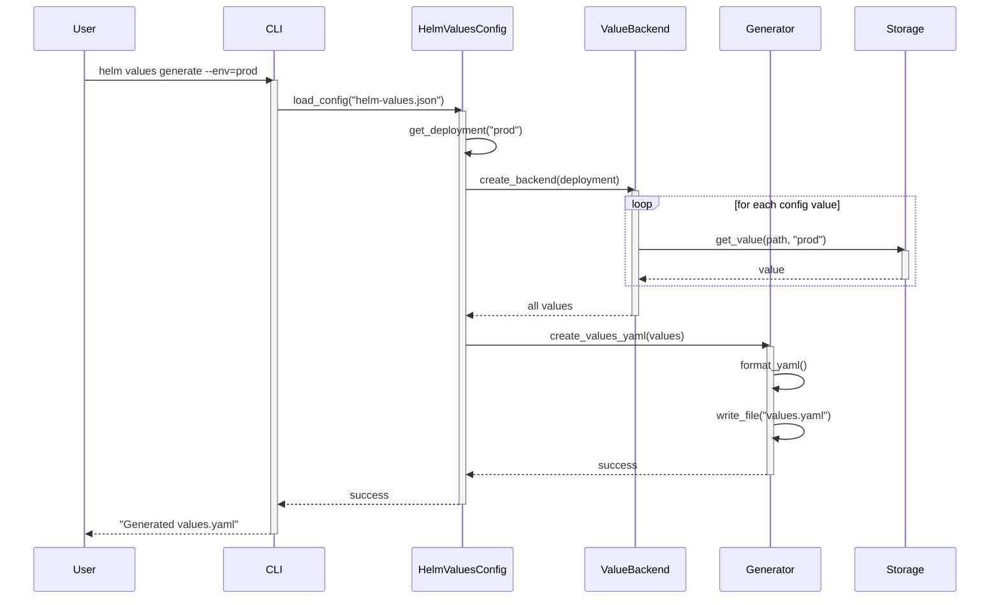
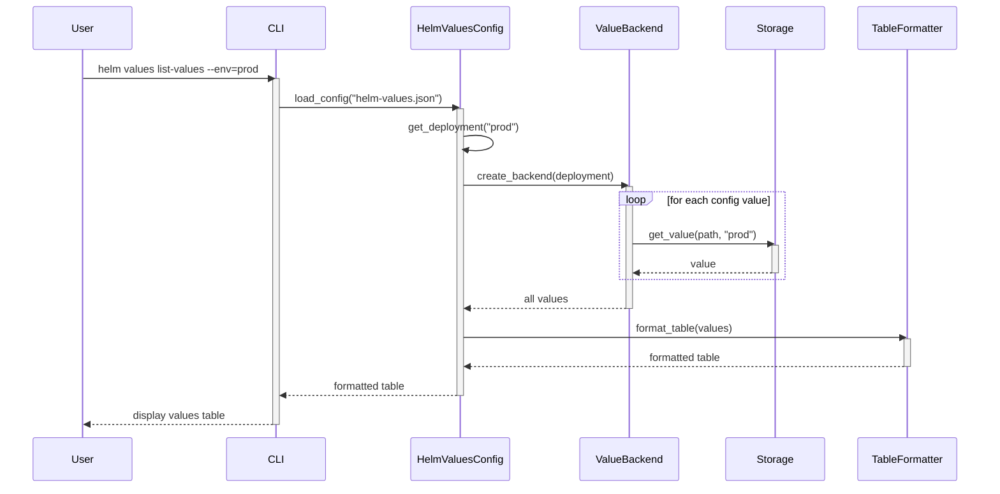
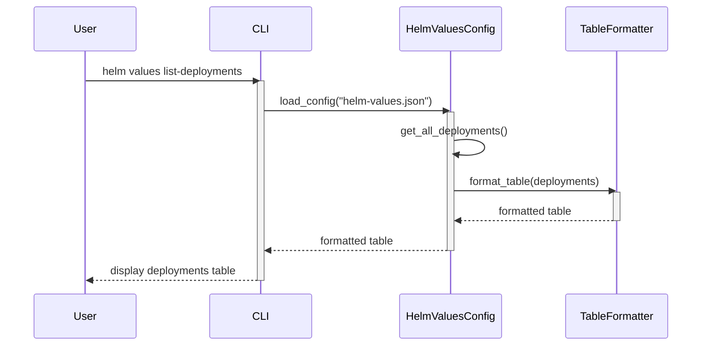
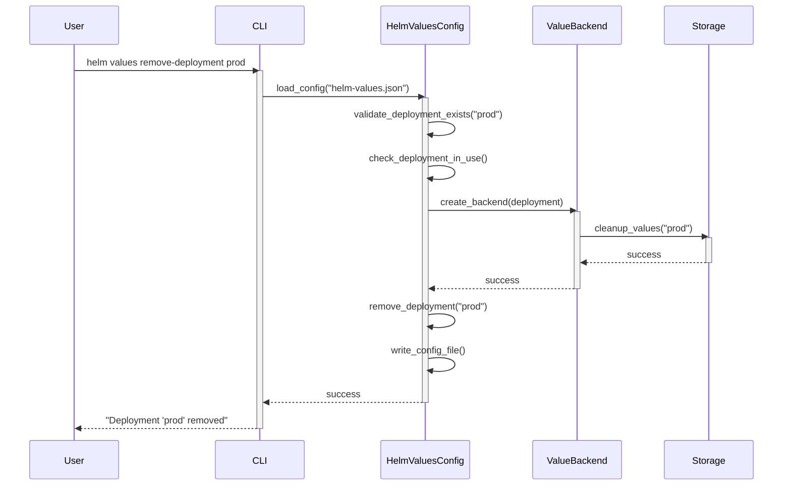
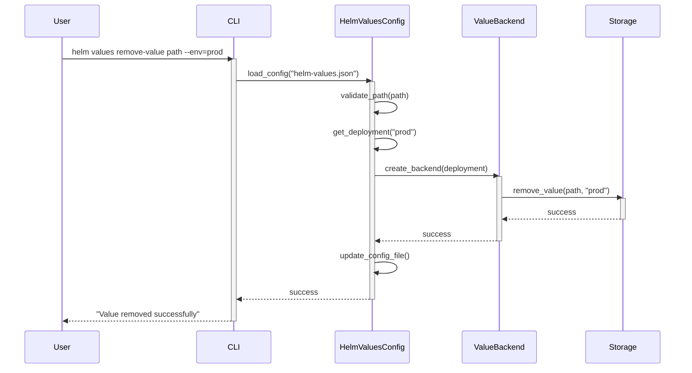

# Helm Values Manager - CLI Command Sequence Diagrams

## 1. Init Command Flow

## 2. Add Deployment Command Flow

## 3. Set Value Command Flow

## 4. Get Value Command Flow

## 5. Validate Command Flow

## 6. Generate Command Flow

## 7. List Values Command Flow

## 8. List Deployments Command Flow

## 9. Remove Deployment Command Flow

## 10. Remove Value Command Flow

Each diagram shows:
- The exact CLI command being executed
- All components involved in processing the command
- Data flow between components
- Validation steps
- File system operations
- Success/error handling

The main CLI commands covered are:
1. `init` - Initialize new configuration
2. `add-deployment` - Add a new deployment configuration
3. `set-value` - Set a value for a specific path and environment
4. `get-value` - Retrieve a value for a specific path and environment
5. `validate` - Validate the entire configuration
6. `generate` - Generate values.yaml for a specific environment
7. `list-values` - List all values for a specific environment
8. `list-deployments` - List all deployments
9. `remove-deployment` - Remove a deployment configuration
10. `remove-value` - Remove a value for a specific path and environment
