# Helm Values Manager - CLI Command Sequence Diagrams

## 1. Init Command Flow

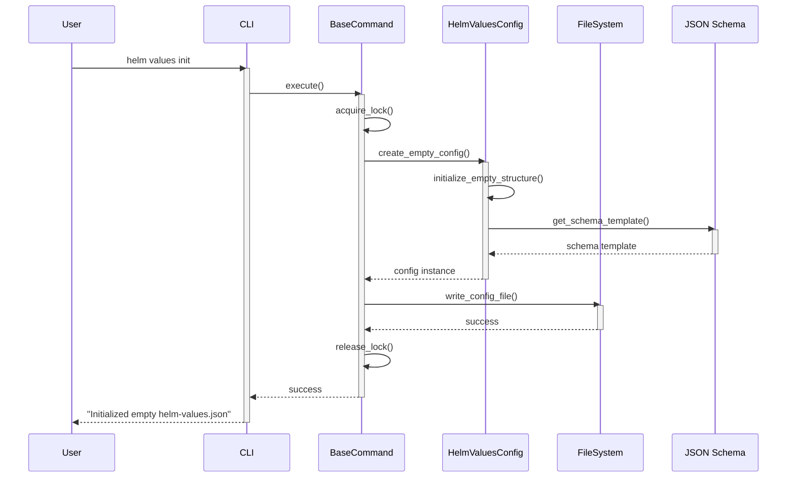

## 2. Add Value Config Command Flow

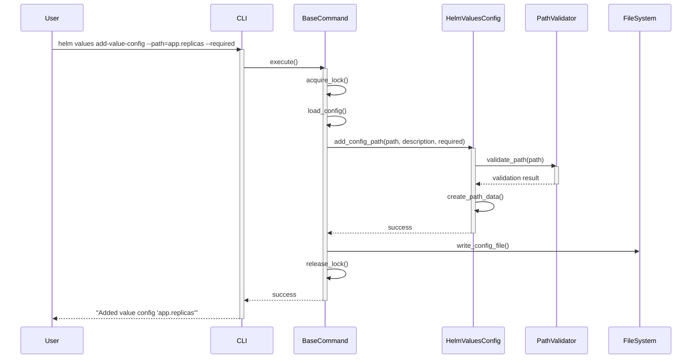

## 3. Add Deployment Command Flow

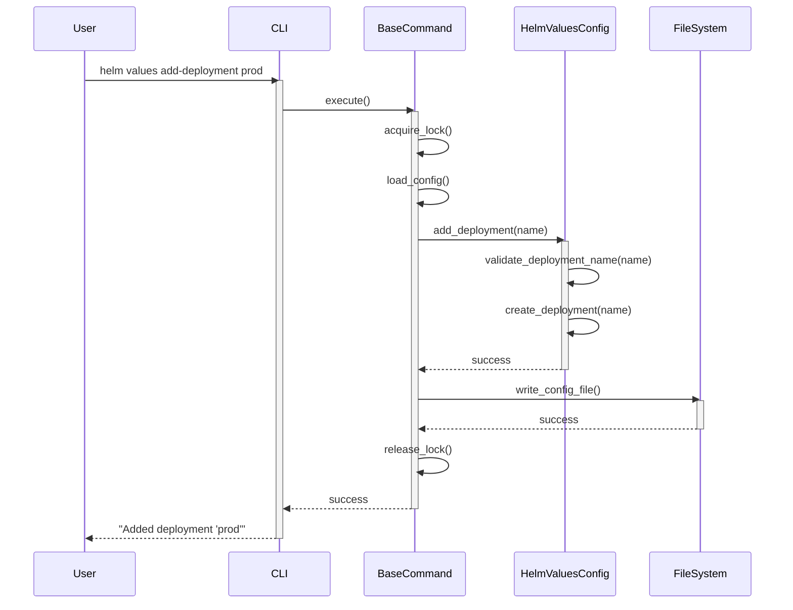

## 3.1 Add Backend Command Flow (Future Implementation)

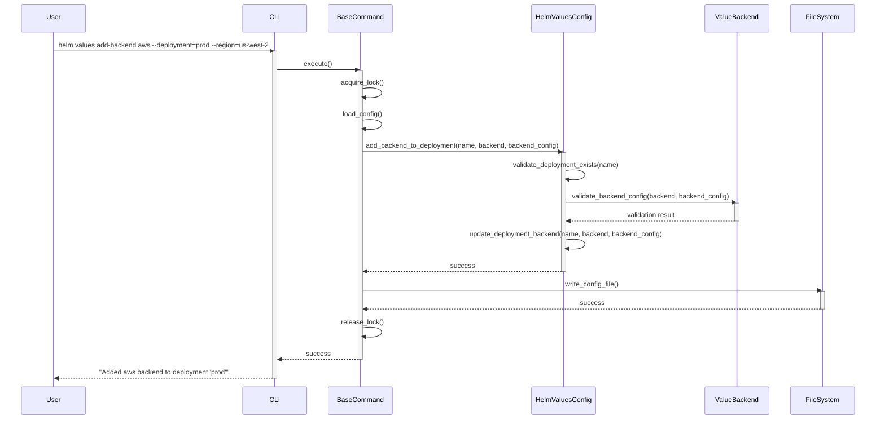

## 3.2 Add Auth Command Flow (Future Implementation)

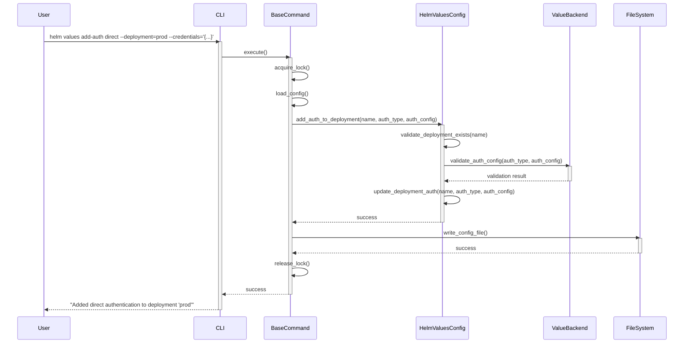

## 4. Set Value Command Flow

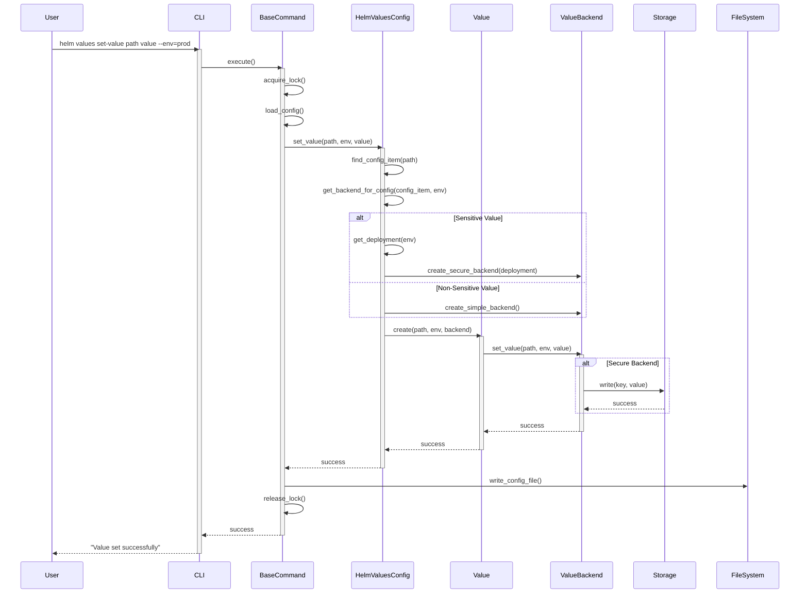

## 5. Get Value Command Flow

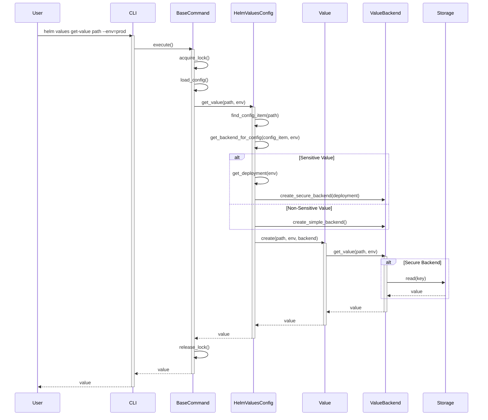

## 6. Validate Command Flow

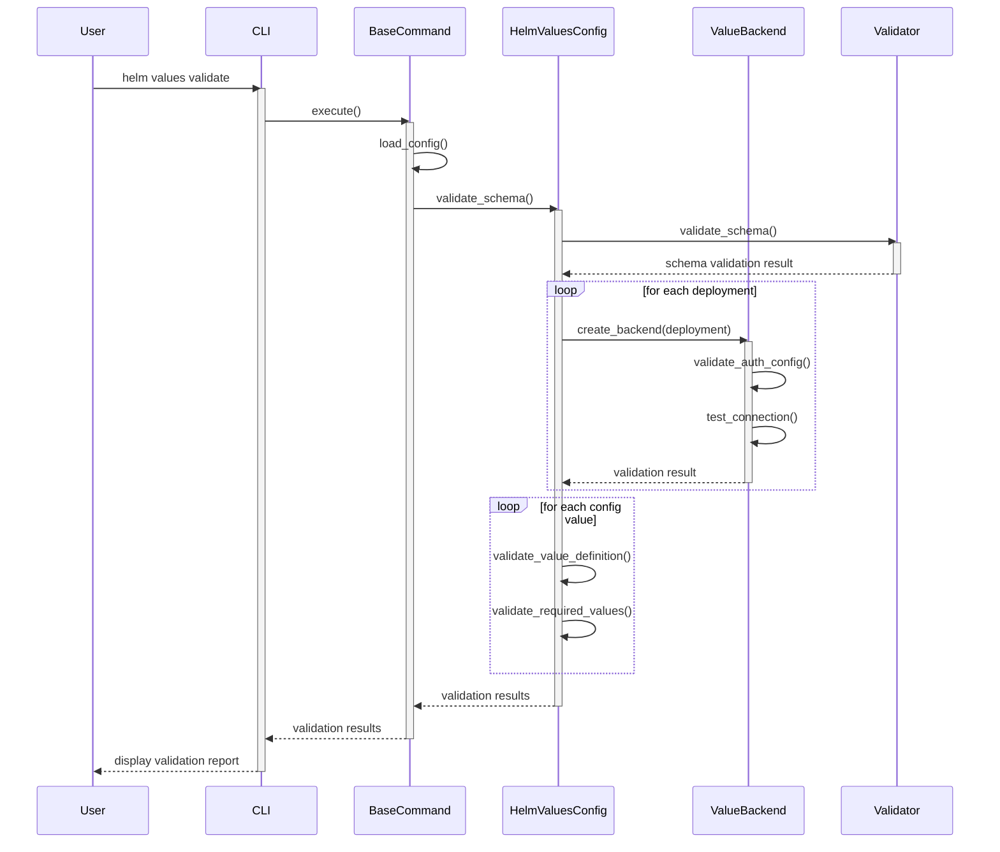

## 7. Generate Command Flow

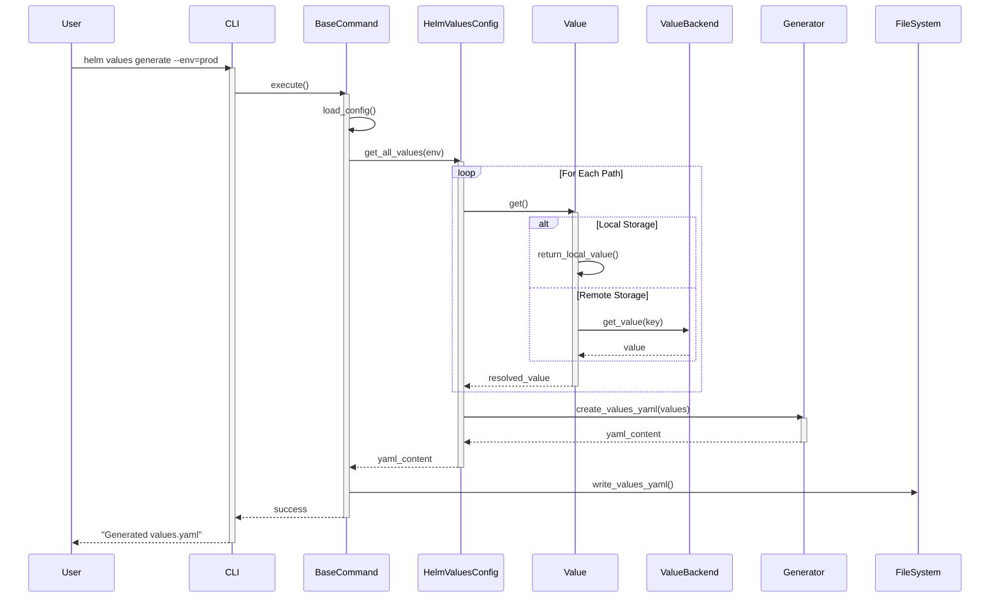

## 8. List Values Command Flow

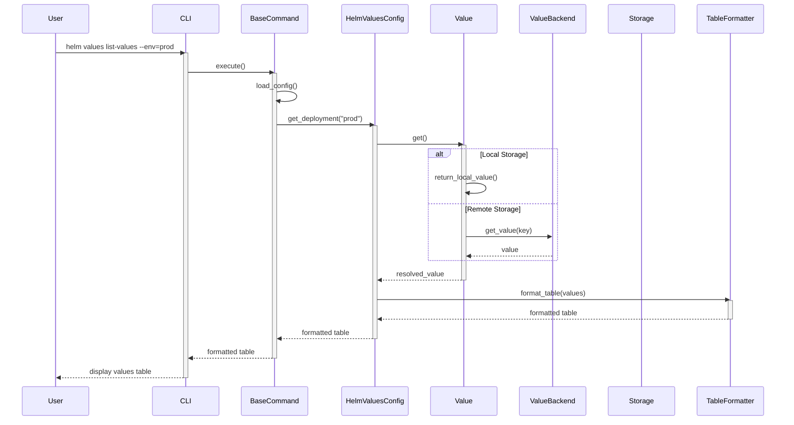

## 9. List Deployments Command Flow

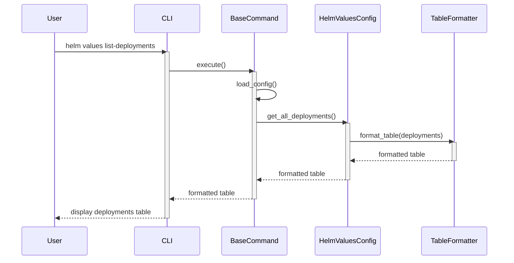

## 10. Remove Deployment Command Flow

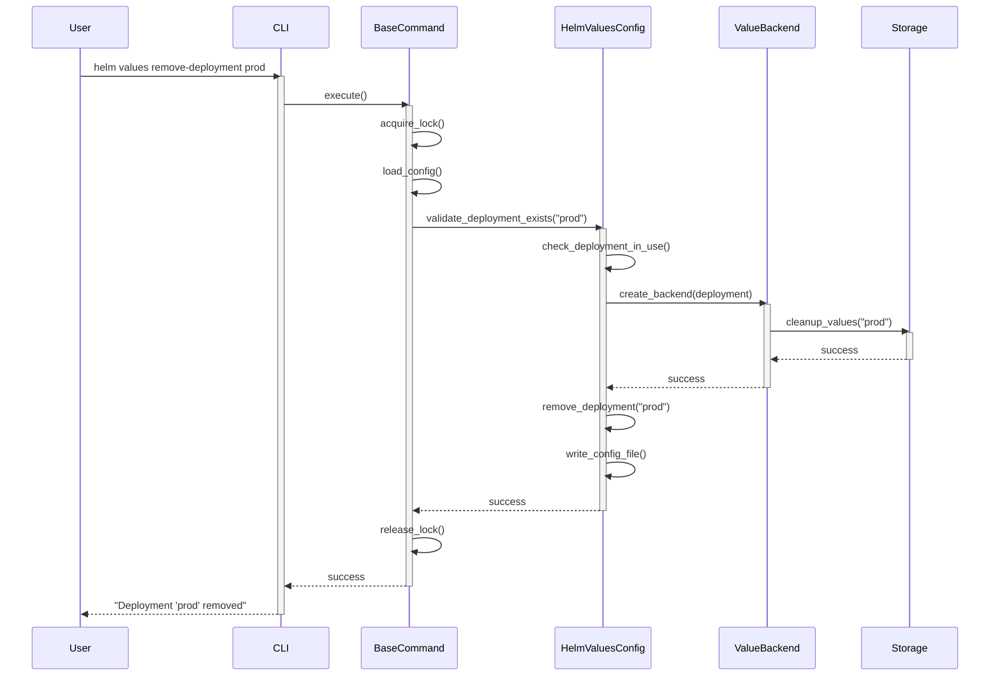

## 11. Remove Value Command Flow

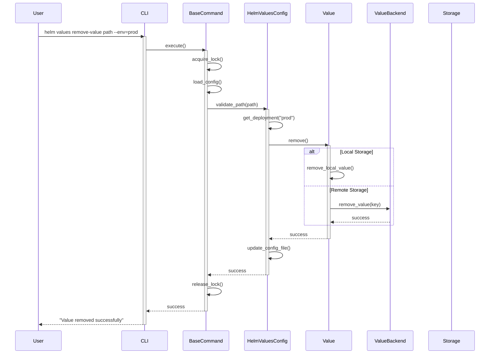

## 12. Remove Value Config Command Flow

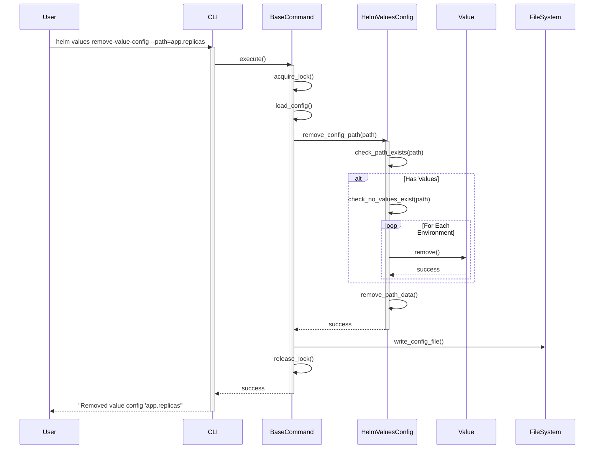

Each diagram shows:
- The exact CLI command being executed
- All components involved in processing the command
- Data flow between components
- Validation steps
- File system operations
- Success/error handling

The main CLI commands covered are:
1. `init` - Initialize new configuration
2. `add-value-config` - Define a new value configuration with metadata
3. `add-deployment` - Add a new deployment configuration
4. `set-value` - Set a value for a specific path and environment
5. `get-value` - Retrieve a value for a specific path and environment
6. `validate` - Validate the entire configuration
7. `generate` - Generate values.yaml for a specific environment
8. `list-values` - List all values for a specific environment
9. `list-deployments` - List all deployments
10. `remove-deployment` - Remove a deployment configuration
11. `remove-value` - Remove a value for a specific path and environment
12. `remove-value-config` - Remove a value configuration and its associated values
